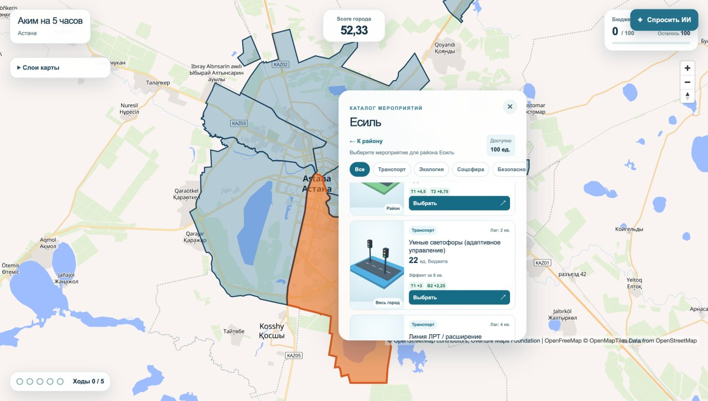
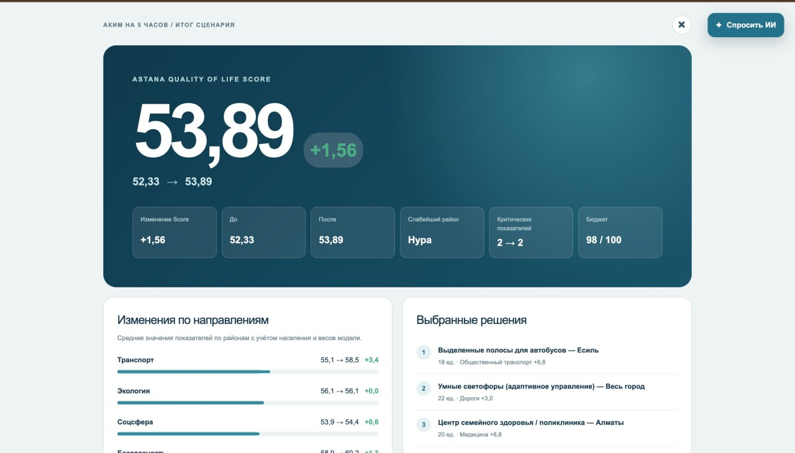
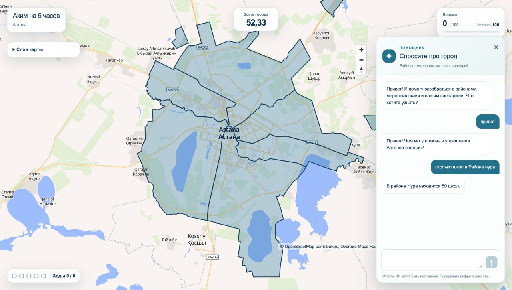

<a id="top"></a>

# Аким на 5 часов

**AI-симулятор городских решений · Команда «Алем жив» · HackAlem AI**

Распределите бюджет между городскими инициативами и посмотрите, как пять решений меняют качество жизни в районах Астаны. Интерактивная карта, расчёт последствий и объяснение результата помогают увидеть компромиссы до реализации сценария.

**6 районов · 16 мероприятий · 5 решений · 100 единиц бюджета**

[About Project](#about-project) · [Model](#model) · [AI Assistant](#ai-assistant) · [Getting Started](#getting-started) · [Stack](#stack) · [Screenshots](#screenshots) · [Documentation](#documentation) · [Contributors](#contributors) · [License](#license)

<a id="about-project"></a>

## About Project

«Аким на 5 часов» — интерактивный тренажёр управления городом для жителей, аналитиков и участников обсуждения городских инициатив. Пользователь выбирает мероприятия в рамках общего бюджета, а симулятор показывает изменения по районам и итоговый **Astana Quality of Life Score**.

### Что можно сделать

- **Исследовать Астану:** выбрать район на карте, посмотреть исходные показатели и включить слои инфраструктуры, парков, дорог и ЛРТ.
- **Собрать сценарий:** выбрать ровно пять мероприятий в направлениях «Транспорт», «Экология», «Соцсфера», «Безопасность» и «Сервисы». У каждого мероприятия есть стоимость, срок проявления эффекта и целевые показатели.
- **Оценить результат:** сравнить Score до и после, изменения по районам, состояние самого слабого района и число критических показателей.
- **Получить объяснение:** прочитать разбор рассчитанного сценария. API также сравнивает выбор пользователя с лучшим допустимым набором в текущей модели.
- **Спросить ИИ:** обсудить выбранный район, мероприятия и результат сценария с помощником прямо на карте.
- **Работать с аккаунтом:** зарегистрироваться и войти через интерфейс; API поддерживает сохранение сценариев и историю пользователя в PostgreSQL.

<a id="model"></a>

## Model

Расчётная модель `v2-saraishyk` описывает шесть районов Астаны: Есиль, Алматы, Сарыарку, Байконур, Нуру и Сарайшык. У каждого района есть десять показателей от 0 до 100 — от доступности транспорта и школ до качества воздуха и надёжности ЖКХ.

Вы выбираете **5 мероприятий из 16** при бюджете **100 единиц**. Модель оценивает их эффект на горизонте **8 кварталов**: учитывает время реализации, совместимость и взаимное усиление мер. Например, если эффект проявляется через два квартала, в расчёт входит 6/8 его полной величины.

Итоговый **Astana Quality of Life Score** складывается из трёх частей:

- **70%** — средний балл районов с учётом доли населения.
- **30%** — балл самого слабого района.
- **Минус 1 балл** за каждый показатель района ниже 40.

Такой подход поощряет улучшение города в целом и помощь отстающим районам. Backend также перебирает допустимые сочетания мероприятий и находит лучший сценарий по этим правилам, чтобы сравнить его с вашим выбором. Одинаковый набор решений всегда даёт одинаковый Score.

Формула и ограничения подробно описаны в [документации модели](Readme-backend.md#формула-и-ограничения).

> Показатели, стоимость и эффекты мероприятий основаны на синтетическом конкурсном датасете. Симулятор предназначен для обучения и сравнения сценариев, а геоданные служат пространственным контекстом. Результаты не являются прогнозом реальных последствий или официальной городской статистикой.

<a id="ai-assistant"></a>

## AI Assistant

ИИ-ассистент помогает разобраться в данных города и своих решениях. Откройте панель **«Спросить ИИ»** и задайте вопрос, например: «Что известно о выбранном районе?» или «Как мои решения повлияли на результат?». Чат доступен после входа в аккаунт.

Помощник получает контекст текущего экрана: выбранный район и его статистику, список мероприятий, бюджет и результат расчёта. Это позволяет обсуждать свой сценарий без повторного ввода всех данных. Ответы приходят на русском языке; точные показатели можно сверить с карточками района и экраном результатов.

По умолчанию чат и объяснение результата используют **GPT-4.1 mini** (`gpt-4.1-mini-2025-04-14`) через OpenAI API. Языковая модель формулирует ответы, а числовой Score рассчитывается по правилам симулятора. Модель можно изменить через `SIMULATION_LLM_MODEL`.

На экране результатов раздел **AI Analysis** объясняет итог, основные риски и сравнение с лучшим сценарием. Backend проверяет числа и упомянутые мероприятия в этом объяснении; если проверка не проходит, запрашивает одно исправление и при необходимости возвращает шаблонный текст. Сильные стороны, риски и рекомендации в отдельных списках формируются по правилам расчёта.

Для подключения добавьте `OPENAI_API_KEY` в `.env` и перезапустите проект командой `docker compose up -d --build`. Ключ используется на серверах Next.js и backend и не передаётся браузеру. Без ключа или при недоступности API чат не сможет ответить, но симуляция продолжит работать с шаблонным объяснением результата.

<a id="getting-started"></a>

## Getting Started

### Требования

- Git — чтобы клонировать репозиторий.
- Запущенный Docker Desktop с Linux-контейнерами либо Docker Engine с Compose v2.
- Свободные порты `3000`, `8081` и `5432`.

Node.js, Java и PostgreSQL устанавливать на компьютер для Docker-запуска не нужно: окружение собирается внутри контейнеров. При первой сборке требуется интернет для загрузки образов и зависимостей; подложка карты также загружается из сети.

### 1. Получите проект

```bash
git clone https://github.com/BAITC-Hacks/hack-61391193-team.git
cd hack-61391193-team
```

Если репозиторий уже скачан, откройте терминал в его корне — рядом с `compose.yaml`.

### 2. Запустите весь проект

Команда подходит для PowerShell, macOS и Linux. Она использует готовые локальные настройки из `.env.example`; API-ключ для первого запуска не требуется.

```bash
docker compose --env-file .env.example up -d --build --wait --wait-timeout 180
```

Compose собирает и запускает три сервиса:

| Сервис | Что внутри | Адрес на компьютере |
|---|---|---|
| `frontend` | Интерфейс Next.js: карта, каталог мероприятий, результат сценария, вход и регистрация | [http://localhost:3000](http://localhost:3000) |
| `backend-akim` | Java API: расчёт, справочники, геоданные, авторизация и история | `http://localhost:8081/api/v1` |
| `postgres` | PostgreSQL: аккаунты, каталог районов и сохранённые сценарии | `localhost:5432` |

PostgreSQL стартует первым. Backend ожидает готовности БД и применяет миграции Flyway; frontend запускается после готовности backend. Внутри Docker интерфейс обращается к `http://backend-akim:8080` — этот адрес уже настроен в Compose.

Если у вас уже настроен собственный `.env`, используйте его вместо примера:

```bash
docker compose up -d --build --wait --wait-timeout 180
```

### 3. Откройте приложение

Откройте **[localhost:3000](http://localhost:3000)** в браузере. Выберите район на карте, добавьте пять мероприятий в пределах бюджета и нажмите **«Подвести итог»**. Вы увидите оценку города и объяснение результата. Регистрация для этого не нужна.

Для разработчиков: [документация API и проверка запросов в Swagger](http://localhost:8081/swagger-ui/index.html).

### Проверка и управление

```bash
# Статус контейнеров
docker compose --env-file .env.example ps

# Логи приложения
docker compose --env-file .env.example logs -f frontend backend-akim

# Остановка с сохранением данных PostgreSQL
docker compose --env-file .env.example down
```

Для своего `.env` уберите `--env-file .env.example` из этих команд. Данные PostgreSQL хранятся в именованном томе `postgres-data` и сохраняются после обычного `down`.

| Проверка | Ожидаемый результат |
|---|---|
| `docker compose ... ps` | Три работающих контейнера; `backend-akim` и `postgres` имеют статус `healthy` |
| [Соединение с БД](http://localhost:8081/actuator/health/db) | `{"status":"UP"}` |
| [API через frontend](http://localhost:3000/api/v1/simulation/bootstrap) | JSON с правилами симуляции и `modelVersion: "v2-saraishyk"` |

### Свои настройки и AI-объяснение

Для изменения портов, реквизитов или подключения AI создайте `.env` на основе [.env.example](.env.example). Если `.env` уже существует, отредактируйте его, сохранив текущие значения.

| Переменная | Назначение | Значение в примере / по умолчанию |
|---|---|---|
| `FRONTEND_PORT` | Внешний порт интерфейса | `3000` |
| `BACKEND_PORT` | Внешний порт API | `8081` |
| `POSTGRES_PORT` | Внешний порт PostgreSQL | `5432` |
| `POSTGRES_DB`, `POSTGRES_USER`, `POSTGRES_PASSWORD` | Подключение backend и контейнера БД | Локальные значения в `.env.example` |
| `JWT_SECRET`, `JWT_TTL_SECONDS` | Подпись и время жизни токенов | Ключ для разработки; `3600` секунд |
| `ADMIN_EMAIL`, `ADMIN_PASSWORD`, `ADMIN_USERNAME` | Администратор, создаваемый при первом запуске | `admin@example.com` / `Admin` / `admin` |
| `OPENAI_API_KEY` | Ключ для чата и AI-объяснения результата | Пусто; для расчёта не требуется |
| `SIMULATION_LLM_MODEL` | Языковая модель чата и объяснения | `gpt-4.1-mini-2025-04-14` |
| `SIMULATION_LLM_URL` | Адрес API для объяснения на backend; чат использует OpenAI API | По умолчанию OpenAI Chat Completions |

После изменения `.env` примените настройки:

```bash
docker compose up -d --build --wait --wait-timeout 180
```

Ключ используется серверной частью чата и backend. Поведение чата и объяснения без подключения описано в [AI Assistant](#ai-assistant). Секреты храните в `.env`, который исключён из Git. Реквизиты из примера предназначены для локальной разработки.

### Что лежит в репозитории

```text
.
├── frontend/                  # Next.js: страницы, карта, сценарии и формы входа
│   ├── src/                   # Компоненты, API-клиент и серверные маршруты сессии
│   └── public/                # Статические ресурсы и данные карты
├── backend-akim/              # Java / Spring Boot API
│   └── src/
│       ├── main/              # Расчёт, REST API, авторизация, каталог и миграции БД
│       └── test/              # Тесты backend
├── data1/overture/astana/      # Подготовленные GeoJSON и статистика районов
├── docs1/                     # Датасет, OpenAPI, примеры запросов и описание модели
│   └── screenshots/           # Скриншоты интерфейса для README
├── scripts/                   # Обработка геоданных, запуск и smoke-проверки
├── deploy/                    # Отдельная конфигурация развёртывания с туннелем
├── compose.yaml               # Локальный стек: frontend + backend + PostgreSQL
├── .env.example               # Образец настроек локального запуска
├── Readme-backend.md           # Подробный контракт API и правила расчёта
└── README.md                  # Обзор и быстрый старт
```

### Если не запускается

| Симптом | Что проверить |
|---|---|
| Docker не может подключиться к daemon | Запущен ли Docker Desktop и выбран ли режим Linux-контейнеров |
| Порт уже занят | Измените соответствующий `*_PORT` в `.env` и запускайте Compose без `--env-file .env.example` |
| Backend не стал `healthy` | Посмотрите `docker compose --env-file .env.example logs --tail=100 backend-akim postgres`; проверьте настройки БД и `JWT_SECRET` |
| На карте нет подложки | Проверьте доступ к интернету и OpenFreeMap |

<a id="stack"></a>

## Stack

| Слой | Технологии | Роль |
|---|---|---|
| Frontend | Next.js 16.3.6, React 19.2.8, TypeScript, Tailwind CSS 4 | Интерфейс и серверный прокси к API |
| Карта и визуализация | MapLibre GL JS, OpenFreeMap, Three.js | Интерактивная карта и 3D-превью мероприятий |
| Backend | Java 21, Spring Boot 4.1.1, Maven | REST API, валидация, детерминированный расчёт и оптимизация |
| Данные | PostgreSQL 16, Spring Data JPA / JDBC, Flyway | Хранение аккаунтов, районов, сценариев и миграции |
| Авторизация | Spring Security, JWT, BCrypt, HttpOnly cookie | Вход, роли и серверная сессия frontend |
| AI | GPT-4.1 mini, OpenAI Chat Completions API | Чат о городе и сценарии; объяснение результата с проверкой чисел на backend |
| Геоданные | Overture Maps, OpenStreetMap, GeoJSON; Python / DuckDB для подготовки | Слои города и пространственная статистика |
| Инфраструктура и проверки | Docker Compose, Actuator, OpenAPI / Swagger UI, JUnit, Testcontainers, ESLint | Сборка, диагностика, документация и тестирование |

Поток данных при локальном Docker-запуске:

```text
Браузер → Next.js :3000 → Spring Boot :8080 → PostgreSQL :5432
                              │
                              └→ API модели (необязательно)
```

В этой схеме указаны внутренние порты сервисов; на компьютере API опубликован на `8081`. Версии frontend зафиксированы в [package-lock.json](frontend/package-lock.json), Java-зависимости — в [pom.xml](backend-akim/pom.xml).

<a id="screenshots"></a>

## Screenshots

### Карта и каталог мероприятий

Выбор района, фильтры направлений, стоимость и ожидаемые эффекты городских инициатив.



### Результат сценария

Итоговый Score, изменение относительно исходного состояния, использованный бюджет и выбранные решения.



### Карта с AI-помощником

Панель «Спросите про город»: вопросы о выбранном районе, мероприятиях и своём сценарии рядом с картой.



<a id="documentation"></a>

## Documentation

| Материал | Что найти |
|---|---|
| [Backend и API](Readme-backend.md) | Эндпоинты, авторизация, история, ошибки, формула Score и настройка PostgreSQL |
| [Frontend](frontend/README.md) | Запуск интерфейса для разработки и работа с сессией |
| [OpenAPI](docs1/openapi.yaml) | Сохранённая схема для импорта в Postman или Swagger Editor; актуальная схема доступна у запущенного API по `/v3/api-docs` |
| [Пример сценария](docs1/simulation-example.json) | Пять решений стоимостью 95 единиц для проверки расчёта |
| [Сценарий с Сарайшыком](docs1/simulation-saraishyk-example.json) | Пример для модели шести районов |
| [Геоданные](data1/overture/astana/README.md) | Состав слоёв, происхождение, ограничения и атрибуция |
| [Сарайшык и модель данных](docs1/saraishyk-research.md) | Источники, синтетические показатели и расчёт весов районов |
| [Городские сервисы](docs1/municipal-measures.md) | Мероприятия M15 и M16, параметры и обоснование |

### Проверки при разработке

Для локальных проверок backend нужен JDK 21; интеграционные тесты с Testcontainers используют Docker. Команды выполняются из `backend-akim/`:

```powershell
# Windows / PowerShell
.\mvnw.cmd test
```

```bash
# macOS / Linux
bash ./mvnw test
```

Для frontend используйте Node.js 22 и npm, команды выполняются из `frontend/`:

```bash
npm ci
npm run lint
npm run build
```

<a id="contributors"></a>

## Contributors

Проект команды **«Алем жив»** для HackAlem AI.

| Участник | Направление | Вклад |
|---|---|---|
| [Arsen · @math-lover47](https://github.com/math-lover47) | AI / ML | Первоначальный AI/ML-прототип и пайплайн Laya |
| [Zhunis Ayanat · @barcek2281](https://github.com/barcek2281) | Backend | Java API, расчёт сценариев, работа с данными и документация |
| [@Rask1lll](https://github.com/Rask1lll) | Frontend | Интерфейс, интерактивная карта и пользовательские сценарии |

<a id="license"></a>

## License

Лицензия исходного кода пока не указана: в репозитории отсутствует файл `LICENSE`.

Для геоданных в проекте указана отдельная атрибуция:

> © OpenStreetMap contributors, Overture Maps Foundation

Согласно [описанию данных](data1/overture/astana/README.md#лицензия--атрибуция), слои `building`, `segment` и `land_use` распространяются по ODbL, `place` — по CDLA-Permissive-2.0. Атрибуция источников отображается на карте.

[↑ К началу](#top)
